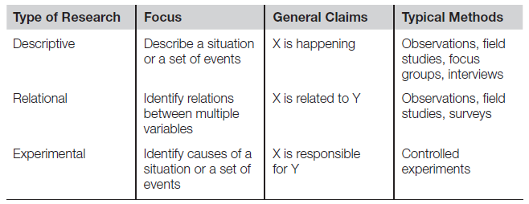
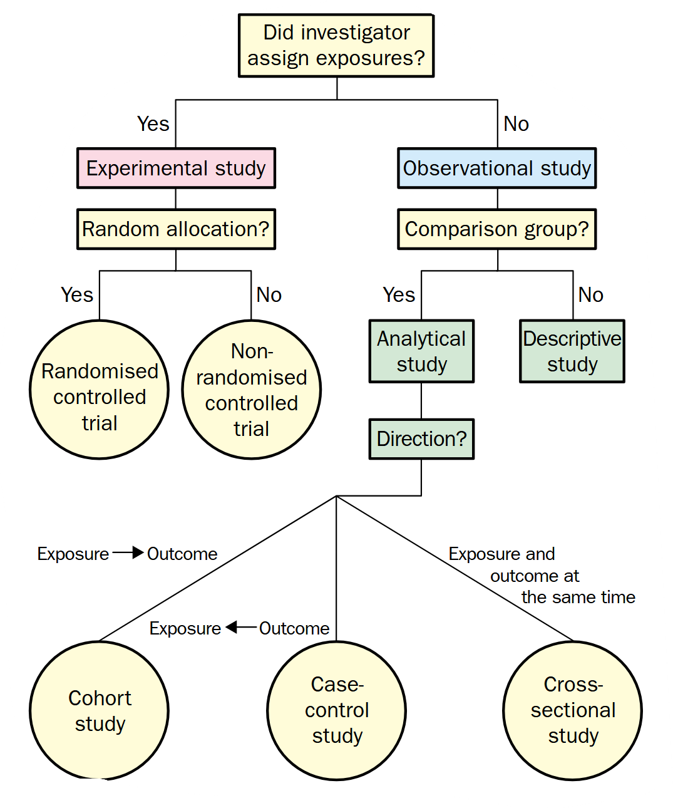
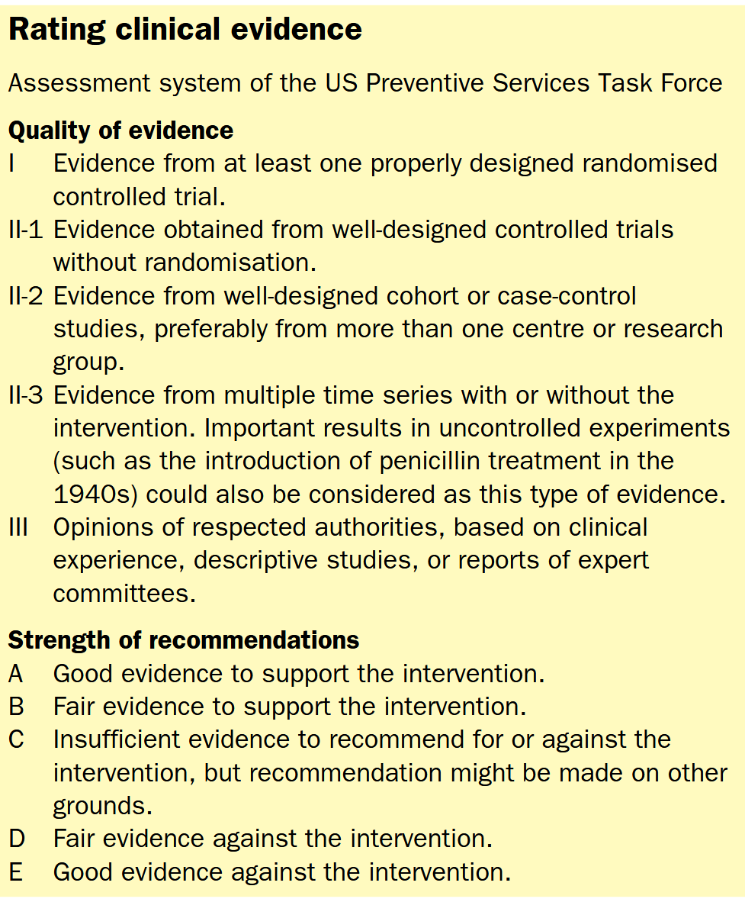
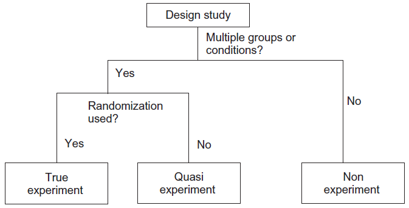
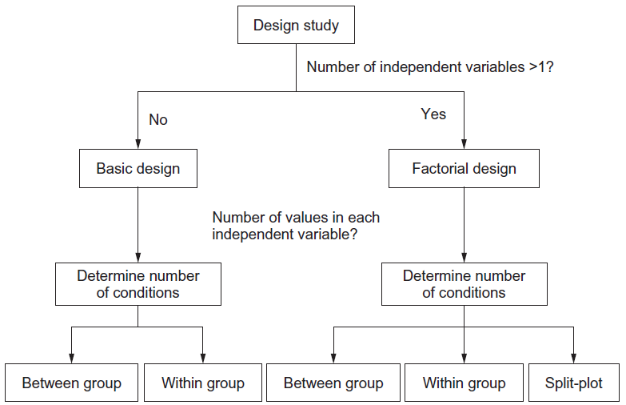
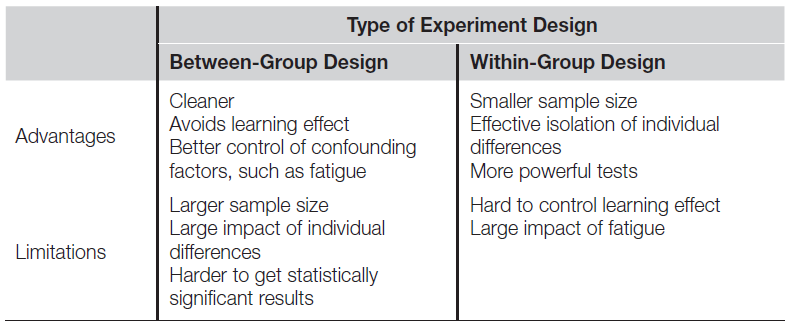

# Design Research Resources

This collection of resources intends to support researchers, especially PhD students, in their daily research activities.  

[TOC]

## Main Journals

Below is a non-exhaustive list of Q1 journals publishing results in the disciplines related to the research conducted by the G-SCOP Collaborative & Integrated Design research group, especially those researching at the cross-roads of systems design and human-computer interaction on the advanced visualisation and interaction platform Vision-R.

### Human-Computer Interaction

- [International Journal of Human-Computer Studies](https://www.sciencedirect.com/journal/international-journal-of-human-computer-studies)
- [Virtual Reality](https://link-springer-com.sid2nomade-2.grenet.fr/journal/10055)
- [International Journal on Human-Computer Interaction](https://www-tandfonline-com.sid2nomade-2.grenet.fr/journals/hihc20)
- [ACM Transactions on Computer-Human Interaction](https://dl.acm.org/journal/tochi)
- [Computers in Human Behavior](https://www.sciencedirect.com/journal/computers-in-human-behavior/about/aims-and-scope)

### Computer-Aided Design and Engineering

- [Computers in Industry](https://www.sciencedirect.com/journal/computers-in-industry)
- [Engineering with Computers](https://www.springer.com/journal/366)
- [Advanced Engineering Informatics](https://www.sciencedirect.com/journal/advanced-engineering-informatics)
- [Journal of Computational Design and Engineering](https://academic.oup.com/jcde?login=false)
- [Artificial Intelligence in Engineering Design, Analysis and Manufacturing](https://www.cambridge.org/core/journals/ai-edam)

### Software Engineering

- [Information and Software Technology](https://www.sciencedirect.com/journal/information-and-software-technology)

### Computer Graphics and Geometric Modelling

- [IEEE Transactions on Visualization and Computer Graphics](https://ieeexplore.ieee.org/xpl/RecentIssue.jsp?punumber=2945)
- [Computer & Graphics](https://ieeexplore.ieee.org/xpl/RecentIssue.jsp?punumber=38)
- [Computer Aided Design](https://www.sciencedirect.com/journal/computer-aided-design)

### Design Theories, Methods, and Tools

- [Research in Engineering Design](https://www.springer.com/journal/163)
- [Design Science](https://www.cambridge.org/core/journals/design-science)
- [Journal of Engineering Design](https://www.tandfonline.com/toc/cjen20/current)
- [International Journal of Design](International Journal of Design)
- [Design Issues](https://direct.mit.edu/desi)
- [Design Studies](https://www.sciencedirect.com/journal/design-studies)
- [International Journal of CoCreation in Design and the Arts](https://www.tandfonline.com/journals/ncdn20)
- [Concurrent Engineering Research and Applications](https://journals.sagepub.com/home/cer)

### Ergonomics

- [Applied Ergonomics](https://www.sciencedirect.com/journal/applied-ergonomics)
- [Ergonomics](https://www.tandfonline.com/journals/terg20)
- [Human Factors](https://journals.sagepub.com/home/HFS)
- [Le travail humain](https://letravailhumain.org/en/)

## Main Conferences

Below is a non-exhaustive list of international conferences publishing results in the disciplines related to the research conducted by the G-SCOP Collaborative & Integrated Design research group, especially the ones supported by the technological platform VISION-R.

### Human-Computer Interaction & Data Visualisation

- [Conference on Human Factors in Computing Systems (CHI)](https://dl.acm.org/doi/proceedings/10.1145/3491102)[International Conference on Human-Computer Interaction (HCI)](https://2023.hci.international/index.html)
- [Special Interest Group on Computer-Human Interaction (SIGCHI)](https://sigchi.org/)
- [ACM Symposium on Applied Perception](https://sap.acm.org/)
- [ACM SIGGRAPH](https://www.siggraph.org/)
- [ACM SIGCHI Design Interactive Systems](https://dis.acm.org/)
- [ACM SIGIR Conference on Human Information Interaction and Retrieval](https://chiir.org/)
- [SIGCHI Symposium on Engineering Interactive Computing Systems](https://eics.acm.org/2023/)
- [Conference on Computer-Supported Cooperative Work (CSCW)](https://cscw.acm.org/)
- [European Conference on Cognitive Ergonomics (ECCE)](https://digitaleconomy.wales/ecce2023/)
- [IEEE VIS](https://ieeevis.org/year/2024/welcome)
- [Eurovis](https://eurovis.org.uk/)
- [IEEE Conference on AI and Extended & Virtual Reality AIxVR](https://aivr.science.uu.nl/)

### Engineering Design

- [International Conference on Engineering Design (ICED)](https://iced.designsociety.org/)
- [Design](https://www.designconference.org/)
- [CIRP Design]()
- [Design Computing and Cognition (DCC)]()
- [International Conference on Research Into Design](https://design.iith.ac.in/icord25/)
- [International Conference on Product Lifecycle Management (PLM)](https://www.plm-conference.org/)
- [Tools and Methods of Competitive Engineering (TMCE)](https://tmce.io.tudelft.nl/)

### Systems Engineering

- [Conference on Systems Engineering Research (CSER)](https://cser.info/)
- [Annual IEEE International Systems Conference (SYSCON)]()
- [IEEE International Symposium on Systems Engineering](https://2025.ieeeisse.org/)
- [INCOSE International Symposium](https://www.incose.org/symp2022/home/what-is-the-international-symposium)
- [IEEE Systems of Systems Engineering Conference (SOSE)]([System of Systems Engineering Conference](https://sosengineering.org/2025/))
- [Annual INCOSE International Workshop](https://www.incose.org/IW2023)
- [INCOSE Human Systems Integration Workshop](https://www.incose.org/hsiws2022)
- [Complex Systems Design & Management Conference (CSDM)](https://cesam.community/csdm-2024/)
- [Model Driven Engineering Languages and Systems (MODELS)](https://conf.researchr.org/home/models-2024)

### Virtual and Augmented Reality

- [IEEE Conference on Virtual Reality (VR) and 3D User Interfaces](http://ieeevr.org/2023)
- [International Conference EuroXR](https://www.euroxr-association.org/euroxr-conferences/)
- [ACM SIGCHI Virtual Reality Software and Technology](https://vrst.acm.org/)
- [IEEE International Symposium on Mixed and Augmented Reality Adjunct (ISMAR-Adjunct)](https://ieeexplore.ieee.org/xpl/conhome/9585620/proceeding)
- [ESA AR/VR for Space Programs](https://indico.esa.int/event/475/)

### Geometric Modelling

- [Symposium on Solid and Physical Modeling (SPM)](https://sites.google.com/view/spm-2023/)
- [Shape Modeling International (SMI)](https://smiconf.github.io/)

# Courses

## UGA-INP 

- [Research Design]
- [Scientific Methodology and Experimental Evaluation](https://mosig.imag.fr/SMEE/SMEE)
- [Initiation to experiment design and research - VPMDIED1 (Phelma)](https://phelma.grenoble-inp.fr/fr/formation/initiation-to-experiment-design-and-research-vpmdied1)
- [UE Basic statistics and Experimental Design (UFR Biologie)](https://formations.univ-grenoble-alpes.fr/fr/catalogue-2021/master-XB/master-biologie-vegetale-KISWRTVR/parcours-planta-international-KISX7I4W/ue-basic-statistics-and-experimental-design-JDA5F0TU.html#)
- [UE Human Computer Interaction]()

## MOOC

- [INRIA Recherche reproductible : principes méthodologiques pour une science transparente](https://www.fun-mooc.fr/fr/cours/recherche-reproductible-principes-methodologiques-pour-une-science-transparente/)

# Special Interest Groups

### Human-Computer Interaction

- [Groupement de Recherche Informatique Géometrique et Graphique, Réalité Virtuelle et Visualisation (GDR IG-RV)](https://gdr-igrv.fr/)
- [Special Interest Group on Computer Graphics and Interactive Techniques (SIGGRAPH)](https://www.siggraph.org/)
- [Association Française de Réalité Virtuelle et Augmentée (AFXR)](https://www.afxr.org/page/1756926-accueil)

### Engineering Design & Systems Engineering

- [Design Society Special Interest Groups](https://www.designsociety.org/group/11/Special+Interest+Groups+%28SIGs%29)
- [International Council on Systems Engineering (INCOSE)](http://www.incose.org/)
- [Association Française d'Ingénierie Système (AFIS)](https://www.afis.fr/)
- [Systems.Manufacturing.Academics.Resources.technologies (S.mart)](https://s-mart.fr/)
- [Société d'Automatique de Génie Industriel & de Productique (SAGIP)](https://www.sagip.org/fr)
- [Groupement de Recherche en Modélisation, Analyse et Conduite de Systèmes dynamiques (GDR MACS)](https://gdr-macs.cnrs.fr/)

## Methodological guidelines

Below is a non-exhaustive list of methodological guidelines for conducting good academic design research, which attempts to understand or improve design research activities.

### Literature Review

- [Faire une revue de la littérature : pourquoi et comment ?](https://hal.science/hal-00657381/file/Pages_15_A_27_-_Dumez_H._-_2011_-_Faire_une_revue_de_littA_rature._-_Libellio_vol._7_nA_2.pdf)
- [Writing a literature review](https://github.com/rpinquie/rpinquie.github.io/blob/master/PhD/biblio/Writing%20a%20literature%20review.pdf)
- [PRISMA Systematic Literature Review](http://www.prisma-statement.org/)
- [PRISMA Systematic Literature Review - Flowcharts](http://www.prisma-statement.org/PRISMAStatement/FlowDiagram)
- [PRISMA-Scoping Review](https://www.prisma-statement.org/scoping)
- [Systematic Literature Reviews: An Introduction](https://www.cambridge.org/core/journals/proceedings-of-the-international-conference-on-engineering-design/article/systematic-literature-reviews-an-introduction/40D4CEA7A7CC3FB6ED6233E79A0A2A1F)
- [Frameworks for developing impactful systematic literature reviews and theory building: What, Why and How?](https://www-tandfonline-com.sid2nomade-2.grenet.fr/doi/epdf/10.1080/12460125.2023.2197700?needAccess=true)
- [Developing classic systematic literature reviews to advance knowledge: Dos and don'ts](https://www-sciencedirect-com.sid2nomade-2.grenet.fr/science/article/pii/S0263237323001330?via%3Dihub)
- [The art of writing literature review: What do we know and what do we need to know?](https://www-sciencedirect-com.sid2nomade-2.grenet.fr/science/article/pii/S0969593120300585?via%3Dihub)

### Evidence (Gap) Map

- [Model and Evidence Mapping Environment (MEME)](https://gitlab.com/inq-seeds/moved2github-boilerplate)

### Evidence-Based Research

### Design Research and Validation Methods

- DRM [link 1](https://link.springer.com/book/10.1007/978-1-84882-587-1), [link 2](https://edisciplinas.usp.br/pluginfile.php/6312877/mod_resource/content/2/Txtei0476%20DRM%202009.pdf),
- Validation square [link 1](https://www.researchgate.net/publication/238355807_The''Validation_Square''-Validating_Design_Methods), [link 2](https://asmedigitalcollection.asme.org/ebooks/book/103/chapter-abstract/22576/The-Validation-Square-How-Does-One-Verify-and?redirectedFrom=fulltext)
- Lot of resources on [S.mart version-controlled and community-based open benchmarking platform](https://github.com/GIS-S-mart/Welcome)

### Experiment Design

- [MOOC Designing, Reunning, and analyzing Experiments](https://www.coursera.org/learn/designexperiments)
- [MIT Experiment design](https://web.mit.edu/6.813/www/sp16/classes/11-experiment-design/#experiment-design-techniques)
- [Designing HCI experiments](https://www3.cs.stonybrook.edu/~mueller/teaching/cse323/05-DesigningHCIExperiments.pdf)

### Statistics

- [Statistical analysis and reporting in R](http://depts.washington.edu/acelab/proj/Rstats/index.html)
- [Practical statistics for HCI](http://depts.washington.edu/acelab/proj/ps4hci/index.html)

### Academic Scientific Writting

- [CIRP Design - How to write a good STC Dn paper](https://github.com/rpinquie/rpinquie.github.io/blob/master/PhD/biblio/How%20to%20write%20a%20good%20Dn%20paper%20v2.pdf)
- [Academic phrasebank](https://github.com/rpinquie/rpinquie.github.io/blob/master/PhD/biblio/Academic%20phrasebanck.pdf)
- [Alternative words](https://github.com/rpinquie/rpinquie.github.io/tree/master/PhD/biblio/Alternative%20words.pdf)
- [Scientific writing](https://github.com/rpinquie/rpinquie.github.io/tree/master/PhD/biblio/Scientific%20writing.pdf)
- [English writing](https://github.com/rpinquie/rpinquie.github.io/tree/master/PhD/biblio/English%20writing.pdf)
- [Citing bibliographic references](https://github.com/rpinquie/rpinquie.github.io/tree/master/PhD/biblio/Citing%20bibliographic%20references.pdf)
- [Grammarly](https://app.grammarly.com/)

### Open Science

- [Recherche Data Gouv](https://entrepot.recherche.data.gouv.fr/loginpage.xhtml;jsessionid=3f3e86caa237b27b725ff95e69ca?redirectPage=%2Fdataverseuser.xhtml)
- [PerSCiDO](https://perscido.univ-grenoble-alpes.fr/)
- [Science Ouverte Université Grenoble Alpes](https://scienceouverte.univ-grenoble-alpes.fr/)
- [Plan de gestion de données selon le CNRS](https://doranum.fr/plan-gestion-donnees-dmp/le-plan-de-gestion-de-donnees-pas-a-pas_10_13143_t94g-9j96/)
- [Plan de gestion de données selon l'UGA](https://scienceouverte.univ-grenoble-alpes.fr/donnees/organiser/pgd/)

### Empirical research

- What is an empirical evidence
- Level of evidence
- ...

## Computational Tools

### Scientific computing

- [GRICAD services for scientific computing](https://gricad.univ-grenoble-alpes.fr/catalogue.html)

### Statistical analysis

- R and RStudio with the [WRS2 package](https://cran.r-project.org/web/packages/WRS2/index.html)
  - [Quick-R tutorial](https://www.statmethods.net/)
- [Minitab](https://www.minitab.com/) (available on Citrix)
- [SPSS](https://www.ibm.com/fr-fr/spss)
- SAS
- [Python statistics.py library](https://docs.python.org/3/library/statistics.html)
- [Jamovi](https://www.jamovi.org/)
- [Datatab](https://datatab.net/)

### Software development

- [IntelliJ IDEA](https://www.jetbrains.com/idea/)

### Activity analysis

- [ActoGraph](https://www.actograph.io/fr/software/description)
- [**B**ehavioral **O**bservation **R**esearch **I**nteractive **S**oftware (BORIS)](https://www.boris.unito.it/)

## SPSS How-To

- [How to get descriptive statistics across groups](https://www.youtube.com/watch?time_continue=10&v=VAcSCK6A1VI&embeds_referring_euri=https%3A%2F%2Fwww.google.com%2Fsearch%3Fq%3Ddesriptive%2Bstatistics%2Bspss%2Bgroups%26rlz%3D1C1GCEA_enFR1144FR1144%26oq%3Ddesriptive%2Bstatistics%2Bspss%2Bgroup&source_ve_path=Mjg2NjY)

- [How to get boxplots across groups](https://www.youtube.com/watch?v=Tj61PgbJ1b4&t=7s&ab_channel=Statorials)

- [How to perform an independent samples T-Test](https://www.youtube.com/watch?v=gHSE6paes2w&ab_channel=Statorials) 

- [How to report results from independent samples t-test](https://www.youtube.com/watch?v=6RK3d5KIgMo&ab_channel=Statorials)

- [How to report results from independent samples t-test in APA style](https://ezspss.com/reporting-an-independent-samples-t-test-from-spss-in-apa-style/)

- [How to detect outliers with the Interquartile Range (IQR) and boxplot](https://www.youtube.com/watch?v=H1i8EUTFVBA&ab_channel=Dr.ToddGrande)

- [How to check assumption of homogeneity of variance with Levene's test](https://www.youtube.com/watch?time_continue=567&v=4mkEZxgxMRA&embeds_referring_euri=https%3A%2F%2Fwww.google.com%2Fsearch%3Fsca_esv%3Dfc24ddbdfeda5bef%26rlz%3D1C1GCEA_enFR1144FR1144%26udm%3D7%26sxsrf%3DAHTn8zp823IaP1lfKRCNt7x8HwLYNAOHyQ&source_ve_path=MzY4NDIsMTM5MTE3LDM2ODQyLDM2ODQyLDI4NjY2)

  

- [How to check assumption of normally distributed with Shapiro-Wilk test (small sample sizes <50 samples) or Kolmogorov-Smirnov test](https://statistics.laerd.com/spss-tutorials/testing-for-normality-using-spss-statistics.php)

- [Shapiro-Wilk test of normality for each level of independent variable](https://www.youtube.com/watch?v=iNrBDxMZWxg&ab_channel=Dr.ToddGrande)

- [How to report a Mann-Whitney U test in APA Style](https://ezspss.com/how-to-report-a-mann-whitney-u-test-from-spss-in-apa-style/)

TO sort:

- https://www.youtube.com/watch?v=H1i8EUTFVBA&ab_channel=Dr.ToddGrande

| Cohen's d | Effect size |
| :-------: | :---------: |
| 0.00-0.19 | Very small  |
| 0.20-0.49 |    Small    |
| 0.50-0.79 |   Medium    |
|   0.80+   |    Large    |

In the first game, for the *Number of Attempts variable*, the Mann–Whitney *U* test was applied (*U* = 64.5, *Z* = −1.572, *p* = 0.121, *r* = 0.297). This result indicates that there are no statistically significant differences between the two conditions. If the outlier (shown in Fig. [5](https://link-springer-com.sid2nomade-2.grenet.fr/article/10.1007/s10055-022-00722-7#Fig5)) is eliminated from Group A (controllers), the result still indicates that there are no significant differences between the two conditions. This outlier does not correspond to any participant with motor problems. For the *Total Time* variable, the Mann–Whitney *U* test was also applied (*U* = 46, *Z* = −2.389, *p* = 0.016**, *r* = 0.452). This result indicates that there are significant differences in favor of the condition that used the controllers, which required less time.

The paired-sample t test shows a significant effect of the technique on the total time spent in the manipulation mode [t=4.025, p=0.0007]. Participants spent significantly less time in the TB condition (24.5% less time).

*Mann-Whitney U test was conducted to determine whether there is a difference in Math test scores between males and females. The results indicate non-significant difference between groups, [U = 53.00, p = .173]. In conclusion, We fail to reject the null hypothesis and conclude that there is no difference in the Math test score between males and females.*

The error score is not normally distributed, so a non-parametric Mann-Whitney U test was performed to evaluate whether the error score differed by testing environment. The results indicated that participants with the 3DGraph (M = **1.765** did not retrieve information significantly better than group with Slides, U = 132, p = .901.

# Types of Research (under construction)

### Descriptive *VS.* Relational *VS.* Experimental Research

Empirical investigation can be categorized into three groups:

- **Descriptive investigations**, such as observations, surveys, and focus groups, focus on constructing an accurate description of what is happening.
- **Relational investigations** enable the researcher to identify relations between multiple factors. That is, the value of factor X changes as the value of factor Y changes.
- **Experimental investigations** enable the researchers to determine the causal effect between two factors.

The three kinds of research methods are not totally independent but highly intertwined. Typical research projects include a combination of two or even three kinds of investigation. Descriptive investigations are often the first step of a research program, enabling researchers to identify interesting phenomena or events that establish the cornerstone of the research and identify future research directions. Relational investigations enable researchers or practitioners to discover connections between multiple events or variables. Ultimately, experimental research provides the opportunity to explore the fundamental causal relations. Each of the three kinds of investigation is of great importance in the process of scientific discovery.

##  Exploratory *VS.* Confirmatory Research

| **Confirmatory Research**                                    | **Exploratory Research**                                     |
| ------------------------------------------------------------ | ------------------------------------------------------------ |
| - Hypothesis testing - Results are held to the highest standards - Data-independent - Minimizes false positives - P-values retain diagnostic value - Inferences may be drawn to wider population | - Hypothesis generating - Results deserve to be replicated and confirmed - Data-dependent - Minimizes false negatives in order to find unexpected discoveries - P-values lose diagnostic value - Not useful for making inferences to any wider population |

### (Non-)Randomised Controlled *VS. *Cohort *VS.* Case-Control *VS.* Cross-Sectional *VS.* Descriptive Study

## Evidence-Based Research

### Quality of Evidence

### Recommended readings

> Grimes, D. A., & Schulz, K. F. (2002). An overview of clinical research: The lay of the land. *The Lancet*, *359*(9300), 57–61. https://doi.org/10.1016/S0140-6736(02)07283-5

## Theory-Driven Research

### Design Research *VS.* HCI Research

Most of the tasks that examine complicated or learned skills or knowledge—such as typing, reading, composition, and problem solving—are less susceptible to learning effects.

# **Design and Human-Computer Interaction Research Methods **(under construction)

## Controlled experiment

### Research hypothesis

An experiment normally starts with a research hypothesis. A hypothesis is a precise problem statement that can be directly tested through an empirical investigation. Compared with a theory, a hypothesis is a smaller, more focused statement that can be examined by a single experiment. In contrast, a theory normally covers a larger scope and the establishment of a theory normally requires a sequence of empirical studies. A concrete research hypothesis lays the foundation of an experiment as well as the basis of statistical significance testing. An experiment normally has at least one null hypothesis and one alternative hypothesis. A null hypothesis typically states that there is no difference between experimental treatments. The alternative hypothesis is always a statement that is mutually exclusive with the null hypothesis. The goal of an experiment is to find statistical evidence to refute or nullify the null hypothesis in order to support the alternative hypothesis. Some experiments may have several pairs of null hypotheses and alternative hypotheses. A null and alternative hypotheses can be stated in classical statistical terms as follows:

- H0: There is no difference between the pull-down menu and the pop-up menu in the time spent locating pages.
- H1: There is a difference between the pull-down menu and the pop-up menu in the time spent locating pages.

From this example, we can see that the null hypothesis usually assumes that there is no difference between two or more conditions. The alternative hypothesis and the null hypothesis should be mutually exclusive. That is, if the null hypothesis is true, the alternative hypothesis must be false, and vice versa. The goal of the experiment is to test the null hypothesis against the alternative hypothesis and decide which one should be accepted and which one should be rejected. The results of any significance test tell us whether it is reasonable to reject the null hypothesis and the likelihood of being wrong
if rejecting the null hypothesis.

There is no limit on the number of hypotheses that can be investigated in one experiment. However, it is generally recommended that researchers should not attempt to study too many hypotheses in a single experiment. Normally, the more hypotheses to be tested, the more factors that need to be controlled and the more variables that need to be measured. This results in very complicated experiments, subject to a higher risk of design flaws. In order to conduct a successful experiment, it is crucial to start with one or more good hypotheses (Durbin, 2004). A good hypothesis normally satisfies the following criteria:

- is presented in precise, lucid language;
- is focused on a problem that is testable in one experiment;
- clearly states the control groups or conditions of the experiment. 

In the early stages of a research project, researchers usually find themselves confronted with a broad and vague task. There are no well-defined research questions. There are no focused, testable research hypotheses. The common way to initiate a research project is to conduct exploratory descriptive investigations such as observations, interviews, or focus groups. Well-conducted descriptive investigations help researchers identify key research issues and come up with appropriate control groups to be manipulated as well as dependent variables to be measured

### Dependent and independent variables

A well-defined hypothesis clearly states the **dependent and independent variables** of the study. Independent variables refer to the factors that the researchers are interested in studying or the possible “cause” of the change in the dependent variable. The term “independent” is used to suggest that the variable is independent of a participant's behavior. Dependent variables refer to the outcome or effect that the researchers are interested in. The term “dependent” is used to suggest that the variable is dependent on a participant's behavior or the changes in the independent variables. In experiments, the primary interest of researchers is to study the relationship between dependent variables and independent variables. More specifically, the researcher wants to find out whether and how changes in independent variables induce changes in dependent variables. A useful rule of thumb to differentiate dependent variables from independent variables is that independent variables are usually the treatments or conditions that the researchers can control while dependent variables are usually the outcomes that the researchers need to measure.

In the HCI field, **independent variables** are usually related to technologies, users, and the context in which the technology is used. Typical independent variables that relate to technology include: 1) different types of technology or devices, such as typing versus speech-based dictation, mouse versus joystick, touch pad, and other pointing devices; 2) different types of design, such as pull-down menu versus pop-up menu, font sizes, contrast, background colors, and website architecture. Typical independent variables related to users include age, gender, computer experience, professional domain, education, culture, motivation, mood, and disabilities. Typical independent variables related to the context of use of technologies include both physical factors, such as environmental noise, lighting, temperature, vibration, users' status (e.g., seated, walking or jogging), and social factors, such as the number of people surrounding the user and their relation to the user.

**Dependent variables** frequently measured can be categorized into five groups: efficiency, accuracy, subjective satisfaction, ease of learning and retention rate, and physical or cognitive demand. Efficiency describes how fast a task can be completed. Typical measures include time to complete a task and speed (e.g., words per minute, number of targets selected per minute). Accuracy describes the states in which the system or the user makes errors. The most frequently used accuracy measure is error rate. In HCI studies, efficiency and accuracy are not isolated but are highly related factors. There is usually a trade-off between efficiency and accuracy, meaning that, when the other factors are the same, achieving a higher speed will result in more errors and ensuring fewer errors will lower the speed. Consequently, any investigation that only measures one of the two factors misses a critical side of the picture. Subjective satisfaction describes the user's perceived satisfaction with the interaction experience. The data is normally collected using Likert scale ratings (e.g., numeric scales from 1 to 5) through questionnaires. Ease of learning and retention rate describe how quickly and how easily an individual can learn to use a new application or complete a new task and how long they retain the learned skills. Dependent variables in the fifth category describe the cognitive and physical demand that an application or a task exerts on an individual or how long an individual can interact with an application without significant fatigue. This category of measures is less studied but they play an important role in technology adoption.

### Components of an experiment

After a research hypothesis is identified, the design of an experiment consists of three components: treatments, units, and assignment method. Treatments, or conditions, refer to the different techniques, devices, or procedures that we want to compare. Units are the objects to which we apply the experiment treatments. In the field of HCI research, the units are normally human subjects with specific characteristics, such as gender, age, or computing experience. Assignment method refers to the way in which the experimental units are assigned different treatments.

### Randomisation

The power of experimental research lies in its ability to uncover causal relations. The major reason why experimental research can achieve this goal is because of complete randomization. Randomization refers to the random assignment of treatments to the experimental units or participants. In a totally randomized experiment, no one, including the investigators themselves, is able to predict the condition to which a participant is going to be assigned. Traditional randomization methods include tossing a coin, throwing dice, spinning a roulette wheel, or drawing capsules out of an urn. However, these types of randomization are rarely used in behavioral research and HCI studies nowadays. One method to randomize the selection of experimental conditions or other factors is the use of a random digit table. Nowadays, software-driven randomization is also commonly used among researchers
and practitioners. A large number of randomization software resources are available online, some of them free of charge, such as the services offered at http://www.randomization.com. Randomization functions are also available in most of the commercial statistical software packages, such as SAS, SPSS, and SYSTAT. In a well-designed experiment, you will frequently find that you not only need to randomize the assignment of experiment conditions, but other factors as well. Counter balancing is commonly used in experiments to address the problem of systematic differences between successive conditions. In this case, researchers usually rotate the sequences of treatments or conditions through a “Latin Square Design”.

### Significance tests

Almost all experimental investigations are analyzed and reported through significance tests. When you compare two large populations, there is
no way to collect the data from every individual in the population. Therefore, you select a smaller group from the large population and use that smaller group to represent the entire population. This process is called sampling. Significance tests allow us to determine how confident we are that the results observed from the sampling population can be generalized to the entire population.

### Type I and type II errors

In technical terms, significance testing is a process in which a null hypothesis (H0) is contrasted with an alternative hypothesis (H1) to determine the likelihood that the null hypothesis is true. All significance tests are subject to the risk of Type I and Type II errors. A Type I error (also called an α error or a “false positive”) refers to the mistake of rejecting the null hypothesis when it is true and should not be rejected. A Type II error (also called a β error or a “false negative”) refers to the mistake of not rejecting the null hypothesis when it is false and should be rejected.

It is generally believed that Type I errors are worse than Type II errors. Statisticians call Type I errors a mistake that involves “gullibility.” A Type I error may result in a condition worse than the current state. For example, if a new medication is mistakenly found to be more effective than the medication that patients are currently taking, the patients may switch to new medication that is less effective than their current treatment. Type II errors are mistakes that involve “blindness” and can cost the opportunity to improve the current state. In the medication example, a Type II error means the test does not reveal that the new medication is more effective than the existing treatment; the patients stick with the existing treatment and miss the opportunity of a better treatment.

When designing experiments and analyzing data, you have to evaluate the risk of making Type I and Type II errors. In statistics, the probability of making a Type I error is called alpha (or significance level, P value). The probability of making a Type II error is called beta. The statistical power of a test, defined as 1 − β, refers to the probability of successfully rejecting a null hypothesis when it is false and should be rejected. It should be noted that alpha and beta are interrelated. Under the same conditions, decreasing alpha reduces the chance of making Type I errors but increases the chance of making Type II errors. Simply put, if you want to reduce the chance of making Type I errors with all other factors being the same, you can do so by being less gullible.
However, in doing so, you increase the odds that you miss something that is in fact true, meaning that your research is more vulnerable to Type II errors.
In experimental research, it is generally believed that Type I errors are worse than Type II errors. So a very low P value (0.05) is widely adopted to control the occurrence of Type I errors. If a significance test returns a value that is significant at P < 0.05, it means that the probability of making a Type I error is below 0.05. In other words, the probability of mistakenly rejecting a null hypothesis is below 0.05. In order to reduce Type II errors, it is generally suggested that you use a relatively large sample size so that the difference can be observed even when the effect size is relatively small.

### Experimental design

Before we discuss specific experimental design methods, we need to differentiate three groups of studies: experiments, quasi-experiments, and nonexperiments. If a study involves multiple groups or conditions and the participants are randomly assigned to each condition, it is a true experiment. If a study involves multiple groups or conditions but the participants are not randomly assigned to different conditions, it is a quasi-experiment.
Finally, if there is only one observation group or only one condition involved, it is a nonexperiment. True experiments possess the following characteristics:

- A true experiment is based on at least one testable research hypothesis and aims to validate it.
- There are usually at least two conditions (a treatment condition and a control condition) or groups (a treatment group and a control group).
- The dependent variables are normally measured through quantitative measurements.
- The results are analyzed through various statistical significance tests. 
- A true experiment should be designed and conducted with the goal of removing potential biases.
- A true experiment should be replicable with different participant samples, at different times, in different locations, and by different experimenters.

Most successful experiments start with a clearly defined research hypothesis with a reasonable scope. The research hypothesis is generated based on
results of earlier exploratory studies and provides critical information needed to design an experiment. It specifies the independent and dependent variables of the experiment. The number and values of independent variables directly determine how many conditions the experiment has. The identification of dependent variables will allow us to further consider the appropriate metric for measuring the dependent variables. In many cases, multiple approaches can be used to measure the dependent variables. For example, typing speed can be measured by the number of words typed per minute, which is equal to the total number of words typed divided by the number of minutes used to generate those words. It may also be measured by number of correct words typed per minute, which is equal to the total number of correct words typed divided by the number of minutes used to generate those words. We need to consider the objective of the experiment to determine which measure is more appropriate. Another issue to consider when designing experiments is how to control the independent variables to create multiple experimental conditions

At the first stage of experimental design, we need to construct the experiment based on the research hypotheses that have been developed. This enables us to draw a big picture of the general scope of the experiment and, accordingly, come up with a reasonable estimation of the timeline of the experiment and the budget. The basic structure of an experiment can be determined by answering two questions:

- How many independent variables do we want to investigate in the experiment?
- How many different values does each independent variable have?

The answer to the first question determines whether we need a basic design or a factorial design. If there is one independent variable, we need only a basic one-level design. If there are two or more independent variables, factorial design is the way to go. The answer to the second question determines the number of conditions needed in the experiment. In a basic design, the number of conditions in the experiment is an important factor when we consider whether to adopt a between-group or within-group design. In a factorial design, we have a third option: the split-plot design.
Again, the number of conditions is a crucial factor when weighing up the three options.

**Between-group design** is also called “between-subject design.” In a between-group design, each participant is only exposed to one experimental condition. The number of participant groups directly corresponds to the number of experimental conditions.

In contrast, a **within-group design** (also called “within-subject design”) requires each participant to be exposed to multiple experimental conditions. Only one group of participants is needed for the entire experiment.

From the statistical perspective, between-group design is a cleaner design. Since the participant is only exposed to one condition, the users do not learn from different task conditions. Therefore, it allows us to avoid the learning effect. In addition, since the participants only need to complete tasks under one condition, the time it takes each participant to complete the experiment is much shorter than in a within-group design. As a result, confounding factors such as fatigue and frustration can be effectively controlled. On the other hand, between-group design also has notable disadvantages. In a
between-group experiment, we are comparing the performance of one group of participants against the performance of another group of participants. The results are subject to substantial impacts from individual differences: the difference between the multiple values that we expect to observe can be buried in a high level of “noise” caused by individual differences. Therefore, it is harder to detect significant differences and Type II errors are more likely to occur. In order to effectively exclude the impact of noise and make significant findings, a comparatively larger number of participants are needed under each condition. This leads to the second major disadvantage of the between-group design: large sample size. Since the number of participants (m) in each condition should be comparatively larger than that in a within group design and approximately the same number of participants are needed for each condition (let n be the number of conditions), the total number of participants needed for the experiment (m × n) is usually quite large. For example, if an experiment has 4 conditions and 16 participants are needed under each condition, the total number of participants needed is 64. Recruiting the number of participants needed for a between-group experiment can be a very challenging task.

Within-group design, in contrast, requires a much smaller sample size. When analyzing the data coming from within-group experiments, we are comparing the performances of the same participants under different conditions. Therefore, the impact of individual differences is effectively isolated and the expected difference can be observed with a relatively smaller sample size. If we change the design of the experiment with 4 conditions and 16 participants from a between-group design into a within-group design, the total number of participants needed would be 16, rather than The benefit of a reduced sample size is an important factor for many studies in the HCI field when qualified participants may be quite difficult to recruit. It may also
help reduce the cost of the experiments when financial compensation is provided. Within-group designs are not free of limitations. The biggest problem with a within-group design is the possible impact of learning effects. Since the participants complete the same types of task under multiple conditions, they are very likely to learn from the experience and may get better in completing the tasks. Normally, the potential bias of the learning effect is the biggest concern of experimenters when considering adopting a within-group design. A Latin Square Design is commonly adopted to control the impact of the learning effect. Another potential problem with within-group designs is fatigue. Since there are multiple conditions in the experiment, and the participants need to complete one or more tasks under each condition, the time it takes to complete the experiment may be quite long and participants may get tired or bored during the process. Contrary to the learning effect, which favors conditions completed toward the end of the experiment,
fatigue negatively impacts on the performance of conditions completed toward the end of the experiment. Similarly, the potential problem
of fatigue can also be controlled through the adoption of the Latin Square Design.

Generally speaking, **between-group design should be adopted when** the experiment investigates: simple tasks with limited individual differences; tasks that would be greatly influenced by the learning effect; or problems that cannot be investigated through a within-group design. The size of the individual differences is very hard to estimate. However, it is empirically confirmed that individual differences are smaller when the tasks are simple and involve limited cognitive process. In contrast, individual differences are larger when the task is complicated or involves significant cognitive functions. Depending on the types of task, some experiments are more vulnerable to the learning effect than others. Therefore, within-group design is highly inappropriate for when knowledge would make a great impact on the participant's performance when completing the tasks under the other and between-group design would have to be adopted. There are many circumstances when it is totally impossible to adopt a within-group design. Taking hypotheses H2 and H3, previously stated, as examples: 

- H2: There is no difference in the time required to locate an item in an online store between novice users and experienced users.
- H3: There is no difference in the perceived trust toward an online agent among customers who are from the United States, Russia, China, and Nigeria.

You can see that there is no way to compare the performances of novice users and experienced users through a within-group design because an individual cannot be both a novice user and an experienced user of the online store at the same time. For the same reason, a within-group design is not appropriate for H3 since any participant can only represent one of the four cultures. Under those circumstances, a between-group design is obviously the only option we have.

After choosing a between-group design for an experiment, we need to take special caution to control potential confounding factors. Participants should be randomly assigned to different conditions whenever possible. When assigning participants, we need to try our best to counterbalance potential confounding factors, such as gender, age, computing experience, and internet experience, across conditions. In other words, we need to make sure that the groups are as similar as possible, except for the personal characteristics that are experimental variables under investigation.

**Within-group design is more appropriate when** the experiment investigates tasks with large individual differences, tasks that are less susceptible to the learning effect, or when the target participant pool is very small. As discussed previously, complicated tasks that involve substantial human cognitive and perceptual capabilities generally encounter much larger individual differences than simple tasks. Therefore, when an experiment investigates complicated tasks such as reading, comprehension, information retrieval, and problem solving, a within-group design might be more appropriate since it effectively isolates individual differences from the main effects. Most of the tasks that examine complicated or learned skills or knowledge—such as typing, reading, composition, and problem solving—are less susceptible to learning effects. Difficulty in finding and recruiting qualified participants is a problem frequently faced by many HCI researchers. The problem occurs when the target population is well trained, highly experienced, professionals, such as business executives or experienced project managers, simply because they are too busy to be bothered. Under those circumstances, it is almost impossible to recruit the number of participants needed for a between-group design, forcing the experimenters to adopt a within-group design. Having decided to adopt a within-group design, you need to consider how to control the negative impact of learning effects, fatigue, and other potential problems associated with a within-group design. As discussed previously, a general approach to control these negative impacts is counterbalancing the condition or treatment orders through a Latin Square Design. When the objective of the study is not initial interaction with the application, an
effective approach to reduce the impact of the learning effect is to provide sufficient time for training. Research suggests that, for many types of tasks, the learning curve tends to be steeper during the initial interaction stages and flatter after that stage. People achieve quicker progress in learning during initial stages, followed by gradual lesser improvement with further practice. Therefore, providing sufficient training time for users to get acquainted with the system or the task greatly reduces the learning effect during the actual task sessions. Of course, training cannot completely eliminate the learning effect. It only reduces its impact. This approach, combined with the counterbalancing of task conditions, is widely adopted in HCI studies to control the impact of learning. To address the problem of fatigue caused by multiple experimental tasks, we need to design experiment tasks frugally, reducing the required number of tasks and shortening the experiment time whenever possible. It is generally suggested that the appropriate length of a single experiment session should be 60 to 90 minutes or shorter. When a session lasts longer than 90 minutes, the participant may get tired or frustrated. It is strongly suggested that a single session should definitely not last longer than 2 hours. During the experiment, the participant should be provided with opportunities to take breaks as needed. Interestingly, even when the experimenter encourages the participants to take breaks, the participants may not
realize that they are getting tired and tend to ignore the suggestion to take a break. Therefore, some researchers find it helpful to force the participants to take a break during an experiment.

### Limitations of experimental research

Experimental research methods originated from behavioral research and are largely rooted in the field of psychology. Experimental research has been a highly effective research approach and has led to many groundbreaking findings in behavioral science in the 20th century. Experimental research certainly plays an important role in the field of HCI. A large number of studies that explored fundamental interaction theories and models, such as Fitts' law, employed the approach of experimental research. To date, experimental research remains one of the most effective approaches to making findings that can be generalized to larger populations. On the other hand, experimental research also has notable limitations. It requires well-defined, testable hypotheses that consist of a limited number of dependent and independent variables. However, many problems that HCI researchers or practitioners face are not clearly defined or involve a large number of potentially influential factors. As a result, it is often very hard to construct a well-defined and testable hypothesis. This is especially true when studying an innovative interaction technique or a new user population and in the early development stage of a product.

Experimental research also requires strict control of factors that may influence the dependent variables. That is, except the independent variables, any factor that may have an impact on the dependent variables, often called potential confounding variables, needs to be kept the same under different experiment conditions. This requirement can hardly be satisfied in many HCI studies. For example, when studying how older users and young users interact with computer-related devices, there are many factors besides age that are different between the two age groups, such as educational and knowledge background, computer experience, frequency of use, living conditions, and so on. If an experiment is conducted to study the two age groups, those factors will become confounding factors and may have a significant impact on the observed results. This problem can be partially addressed in the data collection and data analysis stages. In the data collection stage, extra caution should be taken when there are known confounding factors. Increasing the sample size may reduce the impact of the confounding factors. When recruiting participants, prescreening should be conducted to make the participants in different groups as homogeneous as possible. When confounding factors are inevitable, specific data analysis methods can be applied so that the impact of the confounding factors can be filtered out. A common method for this purpose is the analysis of covariables.

Lab-based experiments may not be a good representation of users' typical interaction behavior. It has been reported that participants may behave differently in lab-based experiments due to the stress of being observed, the different environment, or the rewards offered for participation. This phenomenon, called the “Hawthorne effect,” was documented around 60 years ago. In many cases, being observed can cause users to make short-term improvements that typically do not last once the observation is over.

However, it should be noted that the context of the Hawthorne studies and HCI-related experiments is significantly different. First, the Hawthorne studies were all longitudinal while most HCI experiments are not. Secondly, all the participants in the Hawthorne studies were experts in the tasks
being observed while most HCI experiments observe novice users. Thirdly, the Hawthorne studies primarily focused on efficiency while HCI experiments value other important measures, such as error rates. Finally, the participants in the Hawthorne study had a vested interest in a successful outcome for the study since it was a point of contact between them and their senior managemet. In contrast, most HCI studies do not carry this motivation. Based on those reasons, we believe that the difference between the observed results of HCI experiments and the actual performance is not as big as that observed in the Hawthorne studies. But still, we should keep this potential risk in mind and take precautions to avoid or alleviate the impact of the possible Hawthorne effect.

### Quality Criteria

### Exemplary papers

## Observations

### Quality Criteria

### Exemplary papers

## Field studies

### Quality Criteria

### Exemplary papers

## Case studies

The case study protocol should start with an introduction, including the questions and hypotheses. It should continue with details of data collection procedures, including criteria for choosing cases, contact information for relevant individuals; and logistical plans for each case, including time requirements, materials, and other necessary preparations. Specific questions and methods for each of the data sources should be included in the protocol. Finally, the protocol should include an outline of the report that will be one of the products of the case study.

A case study protocol can be a powerful tool for establishing reliability. If your protocol is sufficiently detailed, you should be able to use it to conduct
directly comparable investigations of multiple cases—the protocol guarantees that differences in procedures are not the cause of differences in your observations or results. Ideally, a research protocol will be clear enough that it can be used by other researchers to replicate your results.

## Surveys

### Quality Criteria

### Exemplary papers

## Ethnography

### Quality Criteria

### Exemplary papers

## Focus group

### Quality Criteria

### Exemplary papers

## Interviews

Exploratory interviews share much in common with case studies and ethnography, as they are all intended to provide an understanding of a complex and multifaceted situation.

HCI researchers use interviews and focus groups to help build an understanding of the needs, practices, concerns, preferences, and attitudes of the people who might interact with a current or future computer system. In their focus and breadth, interviews share strengths with several other research techniques. Like usability studies and surveys, interviews often include quantitative results.

### Directed Interview

### Semi-directed Interview

### Allo-confrontation Interview

### Auto-confrontation Interview

> Mollo, V., & Falzon, P. (2004). Auto- and allo-confrontation as tools for reflective activities. *Applied Ergonomics*, *35*(6), 531–540. https://doi.org/10.1016/j.apergo.2004.06.003

### Quality Criteria

### Exemplary papers

##### 

##### 

# Recommended readings

*Want to learn more about design and HCI research methods? Here is a list of sources to start with!*

- [Research Methods for Human-Computer Interaction](https://www.cambridge.org/core/books/research-methods-for-humancomputer-interaction/43E95E979117C42DF822673D098474D2)
- [Research Methods in Human Computer Interaction](https://www.sciencedirect.com/book/9780128053904/research-methods-in-human-computer-interaction)
- [Doing Better Statistics in Human-Computer Interaction](https://www.cambridge.org/core/books/doing-better-statistics-in-humancomputer-interaction/1D19B5419225C05D6E4FE189A345BDB8)
- Reliability and Inter-rater Reliability in Qualitative Research: Norms and Guidelines for CSCW and HCI Practice

*Want to learn more about the validation in design research? Here is a list of sources to start with!*

- Pinquié, R. *et al.* (2024) [Operationalizing community-based open scientific design research benchmarks: application to model-based architecture design synthesis](https://www.cambridge.org/core/journals/proceedings-of-the-design-society/article/operationalizing-communitybased-open-scientific-design-research-benchmarks-application-to-modelbased-architecture-design-synthesis/73855498E1E187C4BB4105C161F2CF0D).
- Eisenbart, B. *et al.* (2024) [Two decades apart and looking forward - exploring rigour in reporting on research in the engineering design research community](https://doi.org/10.1080/09544828.2024.2327912)
- Paehler, L. *et al.* (2023) [Impact of Method Users on the Application of Design Methods—Assessing the Role of Method-related Background Knowledge.](https://doi.org/10.35199/dfx2023.06)
- Escudero-Mancebo, D. *et al* (2023) [Research methods in engineering design : A synthesis of recent studies using a systematic literature review.](https://doi.org/10.1007/s00163-022-00406-y)
- Gericke, K. _et al._ (2022) [Elements of a design method - a basis for describing and evaluating design methods](https://www.cambridge.org/core/journals/design-science/article/elements-of-a-design-method-a-basis-for-describing-and-evaluating-design-methods/A7387B643DBFDB5DF9075261D7D61408)
- Sigmund, O. (2022) [On benchmarking and good scientific practise in topology optimization](https://link.springer.com/article/10.1007/s00158-022-03427-2)
- Pinquié, R. _et al._ (2022) [An open science platform for benchmarking engineering design researches](https://www.sciencedirect.com/science/article/pii/S2212827122007296)
- Prochner, I and Godin, D. (2022) [Quality in research through design projects: Recommendations for evaluation and enhancement]([https://doi.org/10.1016/j.destud.2021.101061](https://doi-org.sid2nomade-2.grenet.fr/10.1016/j.destud.2021.101061))
- Ralph, P. *et al.* (2021) [Empirical standards for software engineering research](https://arxiv.org/abs/2010.03525)
- Eisenmann, M. _et al._ (2021) [Design method validation – an investigation of the current practice in design research](https://www.tandfonline.com/doi/abs/10.1080/09544828.2021.1950655?journalCode=cjen20)
 - Hein, A. M. and Lamé, G. (2020) [Evaluating engineering design methods: taking inspiration from software engineering and the health sciences](https://hal.archives-ouvertes.fr/hal-02866692)
- Gericke, K. et al. (2020) [Supporting designers: moving from method menagerie to method ecosystem](https://www.cambridge.org/core/journals/design-science/article/supporting-designers-moving-from-method-menagerie-to-method-ecosystem/63DA0F12D7C5AB2D94DDFBE40DD7E8ED)
 - Ureten, S. _et al_. (2020) [Current challenges and solution approaches in empirical engineering design research - A workshop for empirical research](https://www.cambridge.org/core/journals/proceedings-of-the-design-society-design-conference/article/current-challenges-and-solution-approaches-in-empirical-engineering-design-research-a-workshop-for-empirical-research/D19541606DDACCE6741D8F47E8B650B7)
- **Isaksson, O. _et al._ (2020) [You need to focus to validate](https://www.cambridge.org/core/journals/proceedings-of-the-design-society-design-conference/article/you-need-to-focus-to-validate/B8301671F8388D4EFED8D4EFE15500D4)**
- Sileyew, K.J. (2019) [Research Design and Methodology](https://www.intechopen.com/chapters/68505)
- Cross, N. (2018) [Developing design as a discipline](https://www.tandfonline.com/doi/abs/10.1080/09544828.2018.1537481?journalCode=cjen20)
- **Cash, P. (2018) [Developing theory-driven design research](https://www.sciencedirect.com/science/article/abs/pii/S0142694X18300140)**
- Panchal, J. H. and Szajnfarber, Z. (2017) [Experiments in systems engineering and design research](https://onlinelibrary.wiley.com/doi/abs/10.1002/sys.21415)
- Vermaas, P. E. (2016) [A logical critique of the expert position in design research: beyond expert justification of design methods and towards empirical validation](https://www.cambridge.org/core/journals/design-science/article/logical-critique-of-the-expert-position-in-design-research-beyond-expert-justification-of-design-methods-and-towards-empirical-validation/E955288CB0F23034B61216D8FB0E7D57)
- Vermaas, P. E. (2016) [Towards precedence that justifies the knowledge claims of design methods.](https://www.tandfonline.com/doi/full/10.1080/14606925.2016.1129144)
- Vermaas, P. E. (2014) [Design theories, models and their testing: On the scientific status of design research](https://link.springer.com/chapter/10.1007/978-1-4471-6338-1_2)
- McMahon, C. (2012) [Reflections on diversity in design research](https://www.tandfonline.com/doi/abs/10.1080/09544828.2012.676634)
- Barth, A. _et al._ (2011) [How to validate research in engineering design?](https://www.designsociety.org/publication/30456/HOW+TO+VALIDATE+RESEARCH+IN+ENGINEERING+DESIGN%3F)
- Blessing, L. and Chakrabarti, A. (2009) [DRM, a Design Research Methodology](https://www.springer.com/gp/book/9781848825864)
- Frey, D. D. and Dym, C. L. (2006) [Validation of design methods: lessons from medicine](https://link.springer.com/article/10.1007/s00163-006-0016-4)
- **Briggs, R. O. (2006) [On theory-driven design and deployment of collaboration systems](https://www.sciencedirect.com/science/article/abs/pii/S107158190600019X).**
- **Seepersad, C. C. _et al._ (2006) [The validation square: How does one verify and validate a design method?](https://asmedigitalcollection.asme.org/ebooks/book/103/chapter-abstract/22576/The-Validation-Square-How-Does-One-Verify-and?redirectedFrom=fulltext)**
- **Sim, S.E. *et al.* (2003) [Using benchmarking to advance research: a challenge to software engineering](https://10.1109/ICSE.2003.1201189)**
- Eckert, C. M. _et al._ (2003) [The spiral of applied research: A methodological view on integrated design research](https://www.designsociety.org/publication/23944/THE+SPIRAL+OF+APPLIED+RESEARCH%3A+A+METHODOLOGICAL+VIEW+ON+INTEGRATED+DESIGN+RESEARCH)
- Pedersen, K. _et al._ (2000) [Validating design methods & research: the validation square.](https://asmedigitalcollection.asme.org/IDETC-CIE/proceedings-abstract/IDETC-CIE2000/35142/379/1093615)
- Cantamessa, M. (2003) [An empirical perspective upon design research.](https://www.tandfonline.com/doi/abs/10.1080/0954482031000078126)
- Hazelrigg, G. A. (2003) [Validation of engineering design alternative selection methods](https://www.tandfonline.com/doi/abs/10.1080/0305215031000097059)
